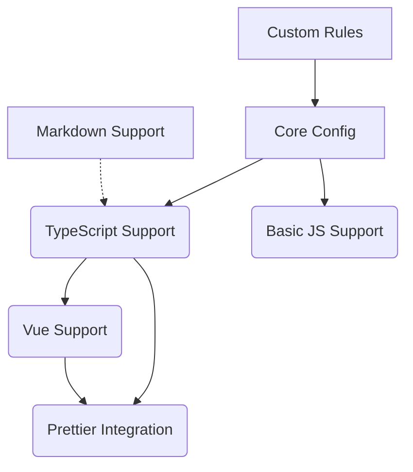

# Feature Landscape

**Domain:** Shared ESLint Configuration
**Researched:** Sun Feb 08 2026

## Table Stakes

Features users expect from a modern shared ESLint config. Missing = config feels outdated or incomplete.

| Feature | Why Expected | Complexity | Notes |
|---------|--------------|------------|-------|
| **Flat Config Support** | The new standard for ESLint (v9+). Essential for future-proofing and performance. | Medium | Must export a flat config array or composer function. |
| **Vue 3 Support** | Core framework for PikaCSS. Must handle SFCs (`.vue`), script setup, and TS in templates. | High | Requires `vue-eslint-parser` and `eslint-plugin-vue` properly configured with TS. |
| **TypeScript Integration** | Standard for modern web dev. Must support type-aware linting. | High | Needs `typescript-eslint` with parser services (`project: true`). |
| **Prettier Compatibility** | Most projects use Prettier. Config must NOT conflict with it. | Low | Use `eslint-config-prettier` to disable formatting rules. |
| **Markdown Linting** | Documentation is key. Code blocks in `.md` files should be linted. | Medium | `eslint-plugin-markdown` or similar processor. |
| **ESM/CJS Support** | Must handle both module systems correctly (e.g., `require` in CJS, `import` in ESM). | Low | Correct `parserOptions` and environment settings. |

## Differentiators

Features that set this config apart, offering superior DX or code quality.

| Feature | Value Proposition | Complexity | Notes |
|---------|-------------------|------------|-------|
| **Import Sorting** | Keeps imports organized automatically. Reduces merge conflicts. | Medium | Use `eslint-plugin-simple-import-sort` or `eslint-plugin-perfectionist`. |
| **Strict Type Safety** | Optional "strict" mode for mission-critical code. Catches more potential runtime errors. | Medium | Enable `strict-type-checked` ruleset from TS-ESLint. |
| **Unused Import Removal** | Keeps code clean and bundle size optimized. | Low | Auto-fixable rule. |
| **JSON/YAML/TOML Support** | Lints config files, ensuring valid syntax and structure. | Medium | Useful in monorepos with many config files. |
| **Custom Rule Integration** | Easy way to add project-specific rules (like PikaCSS architectural boundaries). | High | Needs a plugin architecture or easy override mechanism. |
| **Auto-detection** | Automatically enables Vue/TS rules based on dependencies or file types. | High | Reduces boilerplate in `eslint.config.js`. |

## Anti-Features

Features to explicitly NOT build. Common mistakes in shared configs.

| Anti-Feature | Why Avoid | What to Do Instead |
|--------------|-----------|-------------------|
| **Hardcoded Formatting** | Conflicts with Prettier (e.g., strict indent, semi, quotes). Causes "fighting" between tools. | Defer purely stylistic concerns to Prettier. |
| **Legacy Config (`.eslintrc`)** | Deprecated. Harder to maintain and compose. | Commit fully to Flat Config (`eslint.config.js`). |
| **Overly Strict Naming** | Forcing `IInterface` or specific casing can conflict with framework conventions (e.g. Vue props). | Use sensible defaults that align with Vue/TS community standards. |
| **Global "Fix All"** | Auto-fixing logic that changes code semantics (e.g. strict boolean checks) can be dangerous. | Mark risky rules as `suggestion` instead of `fix`. |

## Feature Dependencies

## MVP Recommendation

For the initial release of `@pikacss/eslint-config`, prioritize:
1.  **Flat Config Base**: Solid foundation compatible with ESLint 9.
2.  **Vue + TS + Prettier**: The "Holy Trinity" for PikaCSS development.
3.  **Basic Import Sorting**: High value-add for organization.

Defer to post-MVP:
- **Strict Type Checking Profiles**: Can be added as an opt-in later.
- **JSON/YAML Linting**: Nice to have, but not critical for code correctness.

## Sources

- **Internal**: `eslint.config.mjs` (current implementation uses `@deviltea/eslint-config`).
- **Ecosystem**: `eslint-plugin-vue` documentation, `typescript-eslint` best practices.
- **Standards**: ESLint Flat Config migration guide.
