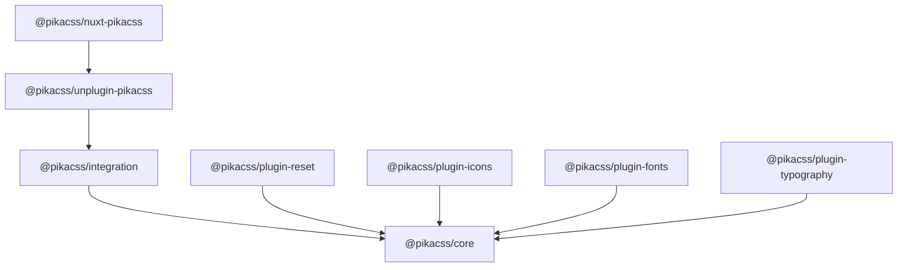

# API Reference

PikaCSS is composed of several packages, each with a focused API.

## Package Overview

### Core Packages

| Package | Purpose |
|---------|---------|
| [`@pikacss/core`](/api/core) | Engine foundation — `createEngine`, `defineEnginePlugin`, identity helpers, types |
| [`@pikacss/integration`](/api/integration) | Build-system bridge — `createCtx`, config loading, source transformation |
| [`@pikacss/unplugin-pikacss`](/api/unplugin) | Universal bundler plugin — Vite, Webpack, Rspack, esbuild, Rollup, Rolldown |
| [`@pikacss/nuxt-pikacss`](/api/nuxt) | Nuxt module — zero-config Nuxt integration |

### Official Plugins

| Package | Purpose |
|---------|---------|
| [`@pikacss/plugin-reset`](/api/plugin-reset) | CSS reset injection |
| [`@pikacss/plugin-icons`](/api/plugin-icons) | Icon shortcuts via Iconify |
| [`@pikacss/plugin-fonts`](/api/plugin-fonts) | Web font loading |
| [`@pikacss/plugin-typography`](/api/plugin-typography) | Prose typography styles |

### Tooling

| Package | Purpose |
|---------|---------|
| [`@pikacss/eslint-config`](/api/eslint-config) | ESLint rules for static analysis |

## Package Graph

## Next

* [Core API](/api/core) — engine functions, types, and identity helpers.
* [Getting Started](/getting-started/what-is-pikacss) — introduction and setup.
