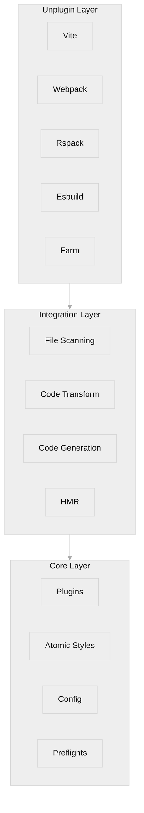
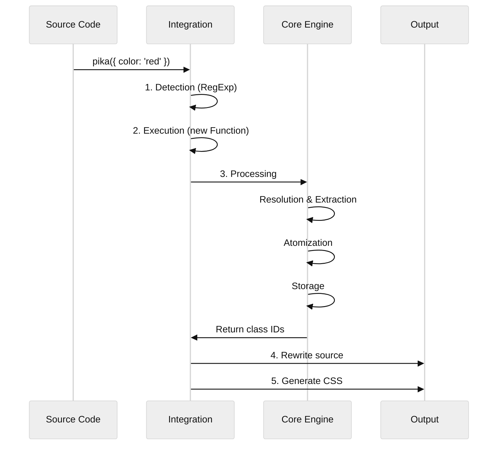

# Architecture & Internals

This document details the internal architecture of PikaCSS, explaining how it transforms CSS-in-JS into Atomic CSS.

## System Overview

PikaCSS is composed of three main layers:



1. **Core (`@pikacss/core`)**: The brain. It manages atomic styles, preflights, plugins, and configuration. It is a pure style processing engine independent of any build tool.

2. **Integration (`@pikacss/integration`)**: The bridge. It handles file scanning, code transformation, CSS/TS code generation, and HMR coordination.

3. **Unplugin (`@pikacss/unplugin-pikacss`)**: The interface. It wraps the Integration layer into plugins for various bundlers (Vite, Webpack, Rspack, Esbuild, Farm) using the `unplugin` library.

## Transformation Pipeline

When `pika({ color: 'red' })` is encountered in the source code, the following process occurs:



### 1. Detection

The `transform` function in the Integration layer scans source code using Regular Expressions to find calls to `pika(...)` and its variants (`pika.str`, `pika.arr`, etc.).

### 2. Execution (Build-Time Evaluation)

**Key Mechanism**: PikaCSS executes the arguments passed to `pika()` **at build time**.

It uses `new Function()` to evaluate the argument string:

```typescript
// Internal implementation (simplified)
const args = new Function(`return ${argsStr}`)()
```

- Input: `"{ color: 'red' }"` (as a string from source)
- Output: `{ color: 'red' }` (as a real JavaScript object)

::: warning Important
Since execution happens in a sandboxed context, it cannot access external variables from the source file. Only self-contained expressions are supported.
:::

### 3. Processing (Core Engine)

The evaluated object is passed to `engine.use()`:

1. **Resolution**: Plugins resolve strings (e.g., `flex-center`) into style objects.
2. **Extraction**: The `extract` function flattens nested `StyleDefinition` objects into a list of `AtomicStyle` candidates.
   - Example: `{ '$:hover': { color: 'red' } }` becomes `color: red` with selector `$:hover`.
3. **Atomization**: The engine generates a unique, short ID (e.g., `a`, `b`) for each unique style.
   - If `color: red` already exists, its existing ID is reused.
4. **Storage**: New atomic styles are stored in the engine's internal store.
5. **Return**: Returns an array of class names (e.g., `['a', 'b']`).

### 4. Rewriting

The original `pika({ ... })` call in the source code is replaced with the generated class names:

- Default: `pika(...)` → `"a b"` (string)
- `pika.arr(...)` → `["a", "b"]` (array)
- `pika.inl(...)` → `"a b"` (string, same as default)

### 5. CSS Generation

The `generate` function iterates through the stored `AtomicStyle`s and converts them into CSS rules:

- `id: "a"`, `prop: "color"`, `val: "red"` → `.a { color: red; }`

These rules are written to the virtual module `pika.css` or the physical file `pika.gen.css`.

## Internal Data Structures

### `EngineConfig`

The user configuration object containing `plugins`, `prefix`, `preflights`, etc.

### `StyleDefinition`

A recursive type representing the user's input style object:

```typescript
interface StyleDefinition {
	[key: string]: string | number | StyleDefinition
}
```

### `AtomicStyle`

The core unit stored in the engine:

```typescript
interface StyleContent {
	selector: string[] // e.g., [".%:hover"] where % is replaced by the ID
	property: string // e.g., "color"
	value: string[] // e.g., ["red"]
}

interface AtomicStyle {
	id: string // e.g., "a"
	content: StyleContent
}
```

### Selector Placeholder

- `.%` - The `%` is replaced by the atomic style ID (e.g., `.a`)
- `$` in user code is replaced by the default selector (e.g., `.%`)

## Core Plugins

PikaCSS includes 5 built-in core plugins that are always loaded:

| Plugin | Purpose |
|--------|---------|
| `important()` | Handles `__important` property for adding `!important` to styles |
| `variables()` | Manages CSS custom properties (variables) |
| `keyframes()` | Handles `@keyframes` animation definitions |
| `selectors()` | Resolves custom selector aliases and transforms |
| `shortcuts()` | Resolves style shortcuts/aliases |

These plugins are applied in this specific order to ensure proper style resolution.

## Implementation Details

### Dynamic Shortcuts

Shortcuts can be defined using RegExp in `pika.config.ts`:

```typescript
shortcuts: [
	[/^m-(\d+)$/, match => ({ margin: `${match[1]}px` })]
]
```

### Icon System

The icon plugin (`@pikacss/plugin-icons`) registers a dynamic shortcut. When matched, it:
1. Loads the SVG from Iconify
2. Encodes it as a Data URI
3. Creates a CSS variable for it
4. Returns a style object using `mask` or `background` to display it

### TypeScript Generation

`pika.gen.ts` is auto-generated to provide `Autocomplete` types, exporting all known shortcuts, properties, and values for IDE intelligence.

### Important Modifier

Use `__important: true` in style objects to add `!important` to all properties:

```typescript
pika({
	__important: true,
	color: 'red'
})
// Output: color: red !important
```
