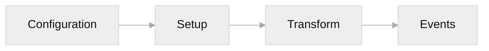

# Plugin System

PikaCSS provides a powerful plugin system that allows you to extend its functionality. This guide covers the basics of using plugins.

::: tip
For advanced topics like creating custom plugins, plugin hooks, and TypeScript module augmentation, see the [Advanced](/advanced/plugin-development) section.
:::

## Overview

The PikaCSS plugin system is built around the concept of hooks that allow plugins to interact with different stages of the CSS generation process.

## Core Plugins

PikaCSS comes with several built-in core plugins that provide essential functionality:

| Plugin | Purpose | Documentation |
|--------|---------|---------------|
| `variables` | Manages CSS custom properties | [Variables](/guide/variables) |
| `keyframes` | Processes @keyframes animations | [Keyframes](/guide/keyframes) |
| `selectors` | Handles custom selector transformations | [Selectors](/guide/selectors) |
| `shortcuts` | Manages style shortcuts | [Shortcuts](/guide/shortcuts) |
| `important` | Handles !important declarations | [Important](/guide/important) |

These plugins are automatically loaded and configured through the engine configuration.

## Using Plugins

To use a plugin, add it to the `plugins` array in your PikaCSS configuration:

```typescript
// pika.config.ts
import { defineEngineConfig } from '@pikacss/unplugin-pikacss'
import { icons } from '@pikacss/plugin-icons'

export default defineEngineConfig({
	plugins: [
		icons() // Add icon support
	]
})
```

::: warning
Don't forget to call the plugin function! A common mistake is writing `plugins: [icons]` instead of `plugins: [icons()]`.
:::

## Plugin Configuration

Many plugins accept configuration options. Plugin-specific configs are placed at the root level of the configuration:

```typescript
// pika.config.ts
import { defineEngineConfig } from '@pikacss/unplugin-pikacss'
import { icons } from '@pikacss/plugin-icons'

export default defineEngineConfig({
	plugins: [icons()],

	// Plugin configuration at root level
	icons: {
		prefix: 'i-',
		scale: 1.2
	}
})
```

## Official Plugins

### Reset Plugin

The `@pikacss/plugin-reset` package provides a modern CSS reset.

```bash
npm install -D @pikacss/plugin-reset
```

```typescript
import { reset } from '@pikacss/plugin-reset'

export default defineEngineConfig({
	plugins: [reset()],
	reset: 'modern-normalize'
})
```

See the [Reset Plugin](/plugins/reset) documentation for more details.

### Icons Plugin

The `@pikacss/plugin-icons` package provides icon support via [Iconify](https://iconify.design/).

```bash
npm install -D @pikacss/plugin-icons
```

```typescript
import { icons } from '@pikacss/plugin-icons'

export default defineEngineConfig({
	plugins: [icons()],
	icons: {
		prefix: 'i-',
		scale: 1
	}
})
```

See the [Icons Plugin](/plugins/icons) documentation for more details.

### Typography Plugin

The `@pikacss/plugin-typography` package provides beautiful typographic defaults for prose content.

```bash
npm install -D @pikacss/plugin-typography
```

```typescript
import { typography } from '@pikacss/plugin-typography'

export default defineEngineConfig({
	plugins: [
		typography() // Note: must call function
	],
	typography: {
		variables: {
			'--pk-prose-color-body': '#374151',
			'--pk-prose-color-headings': '#111827',
		}
	}
})
```

The plugin provides modular shortcuts like `prose-base`, `prose-headings`, `prose-code`, etc., that you can mix and match:

```html
<!-- Use all typography styles -->
<article class="prose">...</article>

<!-- Or compose specific modules -->
<article class="prose-base prose-headings prose-paragraphs">...</article>
```

See the [Typography Plugin](/plugins/typography) documentation for more details.

## Plugin Lifecycle

Plugins interact with the engine through hooks at different stages:



1. **Configuration Phase**: Plugins can modify the raw and resolved configuration
2. **Setup Phase**: Plugins can configure the engine instance (add shortcuts, selectors, etc.)
3. **Transform Phase**: Plugins can transform selectors, style items, and style definitions
4. **Event Phase**: Plugins can react to style changes and updates

## Plugin Order

Plugins can specify an execution order:

- **`'pre'`**: Runs before default-order plugins
- **`undefined`**: Runs in normal order (default)
- **`'post'`**: Runs after default-order plugins

This allows you to control when your plugin runs relative to other plugins.

## Learn More

- [Plugin Development](/advanced/plugin-development) - Create your own plugins
- [Plugin Hooks Reference](/advanced/plugin-hooks) - Complete hook documentation
- [Module Augmentation](/advanced/module-augmentation) - Extend PikaCSS types
- [API Reference](/advanced/api-reference) - Full API documentation
